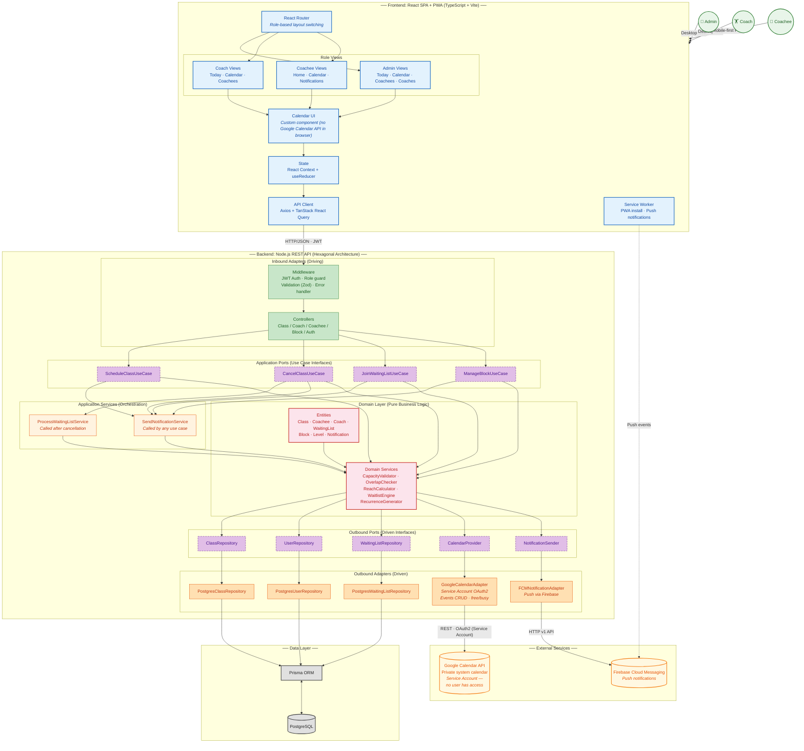
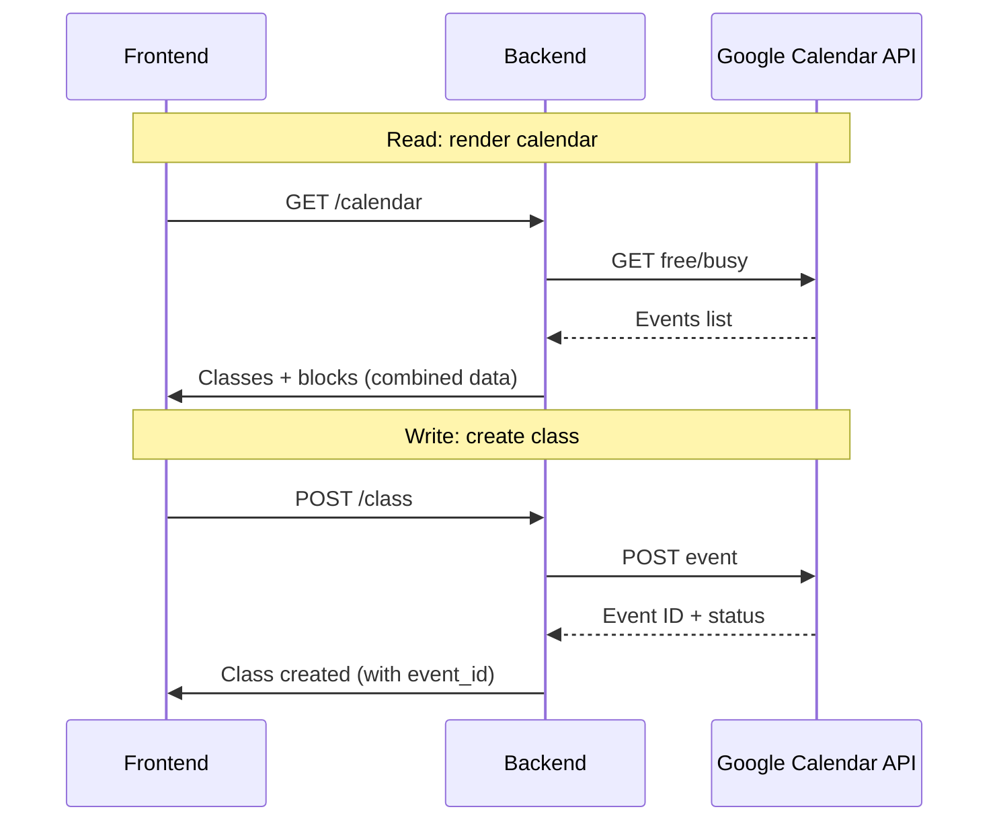
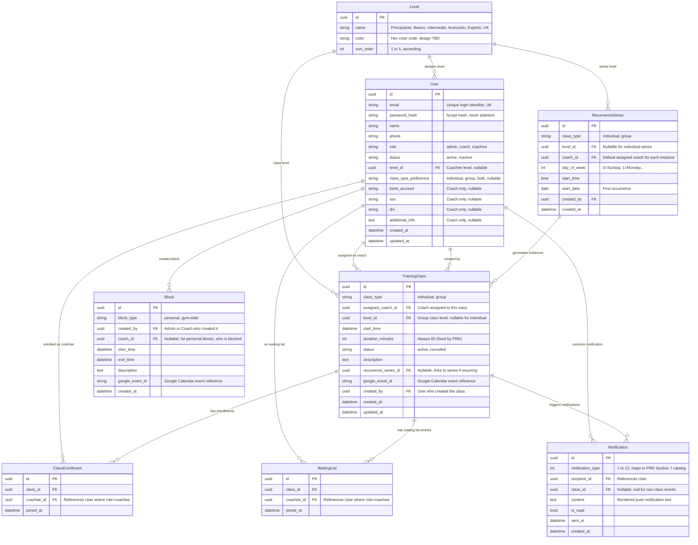

## Índice

0. [Ficha del proyecto](#0-ficha-del-proyecto)
1. [Descripción general del producto](#1-descripción-general-del-producto)
2. [Arquitectura del sistema](#2-arquitectura-del-sistema)
3. [Modelo de datos](#3-modelo-de-datos)
4. [Especificación de la API](#4-especificación-de-la-api)
5. [Historias de usuario](#5-historias-de-usuario)
6. [Tickets de trabajo](#6-tickets-de-trabajo)
7. [Pull requests](#7-pull-requests)
8. [Users and Setup](#8-users-and-setup)

---

## 0. Ficha del proyecto

### **0.1. Tu nombre completo:**
Sara Vicente Jimenez

### **0.2. Nombre del proyecto:**
Coacher

### **0.3. Descripción breve del proyecto:**
Una plataforma para entrenadores personales autonomos que les ayude a gestionar sus calendarios y que permita a sus clientes manejar sus clases de forma autonoma.

### **0.4. URL del proyecto:**
https://coacher-frontend.onrender.com/

### **0.5. URL o archivo comprimido del repositorio**
https://github.com/svicente3/AI4Devs-finalproject

---

## 1. Descripción general del producto

### **1.1. Objetivo:**

Coacher is a single, web-based solution for personal trainers and their teams to manage scheduling, class capacity, client levels, waiting lists, and push notifications for a physical gym with strict space and time constraints. It provides a mobile-first experience for coachees (clients) while giving coaches and admins a desktop-capable dashboard for full operational control.

The platform solves the problem of fragmented scheduling tools (e.g., spreadsheets, messaging apps) by centralising class creation, attendance tracking, level-based visibility, waiting list orchestration, and coach staffing into one system. Google Calendar serves as the internal scheduling engine — accessed exclusively server-side via a private Service Account — so no human user ever interacts with the Calendar API directly.

**Value proposition:**
- **Coaches/Admins** gain a unified view of all classes, blocks, and coachees with automated conflict detection and waiting list processing.
- **Coachees** get a mobile-friendly PWA to view their schedule, join group classes, manage waiting lists, and receive real-time push notifications.
- **The business** eliminates double-bookings, maximises gym capacity (2 individual + 1 group class per hour), and reduces manual coordination overhead.

### **1.2. Características y funcionalidades principales:**

| Feature | Description |
|---|---|
| **Role-based UI** | Single SPA with conditional rendering — Admin, Coach, and Coachee each see only what they need. |
| **Class creation** | Coaches/Admins create individual (1 coachee) or group (3-4 coachees) classes with level, coach assignment, description, and optional weekly recurrence. |
| **Calendar** | Custom UI component rendering all classes and blocks. Colour-coded visibility: blue (own), green (joinable), gray (busy/blocked). Never calls Google Calendar API from the browser. |
| **Level system** | 5 tiers (Principiante, Básico, Intermedio, Avanzado, Experto). Classes are within a coachee's "reach" if they match their level ±1. |
| **Waiting lists** | Max 4 per class. Simultaneous notification to all waitlisted coachees when a spot opens. First-come, first-served, no hold time. |
| **Push notifications** | 12 notification types covering class creation, cancellation, waiting list events, level changes, and coach reassignment. Delivered via Firebase Cloud Messaging. |
| **Time blocks** | Personal blocks (coach's own calendar) and gym-wide blocks (Admin only, blocks all classes). |
| **Coachee dashboard** | Mobile-first home screen showing next class, upcoming joinable group classes (10-day window), and active waiting lists. |
| **PWA support** | "Add to Home Screen" installability via Service Worker. |
| **Google Calendar backend** | All scheduling events synchronised with a private Google Calendar via Service Account — the single source of truth for availability. |

### **1.3. Diseño y experiencia de usuario:**

No design assets available. The intended UX flows are:

**Admin/Coach (desktop responsive):**
- Left sidebar navigation: Today, Calendar, Coachees, Coaches (Admin only).
- **Today page:** Vertical timeline of the day's classes with colour distinction between individual/group/canceled.
- **Calendar page:** Full week/month view with "Add Class" button → modal form (class type, coach, coachees, level, date, recurrence). Available slots surfaced via backend (Google Calendar free/busy).
- **Coachees/Coaches pages:** Filterable tables with status toggles, level filters, and add/edit modals.

**Coachee (mobile-first PWA):**
- Bottom navigation: Home, Calendar, Notifications (bell icon).
- **Home:** Next class card at top, followed by joinable group classes (green cards with "Join" button).
- **Calendar (1-week window):** Colour-coded slots — blue (own class, tap to cancel), green (joinable group), gray (busy block from other coachees, tap to join waiting list).
- **Notifications:** Full chronological history of push notifications.

### **1.4. Instrucciones de instalación:**

See [Section 8 — Users and Setup](#8-users-and-setup) for quick-start and manual setup instructions. The development environment uses Docker Compose (`api` + `db` services) with Prisma migrations and seed scripts. For production infrastructure details, see [`docs/infrastructure.md`](docs/infrastructure.md).

---

## 2. Arquitectura del Sistema

### **2.1. Diagrama de arquitectura:**

The architecture follows the **C4 Model (Context + Container)** combined with a **Hexagonal (Ports & Adapters)** diagram for the backend. C4 communicates the full ecosystem (people, frontend, backend, Google Calendar, FCM) in a single view, while the hexagonal diagram shows how the Clean Architecture mandate from the PRD is fulfilled.

**Why this architecture:**
- **Google Calendar as system of record** requires a replaceable adapter — if they migrate to Outlook Calendar, only the adapter changes.
- **Complex business rules** (gym capacity, waiting lists, level reach, overlap validation) live in the domain layer, testable without infrastructure.
- **Role-based conditional UI** in a single frontend avoids code duplication.
- **Mobile-first + PWA** for coachees means concerns are separated at the component level.

**Benefits:**
- Replaceable `CalendarProvider` port — Google Calendar can be swapped without touching domain logic.
- No bidirectional sync risk — Service Account with private calendar means no external edits.
- Domain services (`CapacityValidator`, `OverlapChecker`, `ReachCalculator`) are pure functions, testable in milliseconds.
- Notifications as a port — adding email/SMS channels requires no business logic changes.

**Trade-offs:**
- Google Calendar API adds latency to every scheduling operation.
- Service Account credential management (key rotation, quota monitoring) is additional infrastructure overhead.
- Cognitive overhead for developers unfamiliar with Hexagonal Architecture.
- E2E tests require mocks for Google Calendar and FCM.



**Calendar Data Flow:**



### **2.2. Descripción de componentes principales:**

| Component | Layer | Role |
|---|---|---|
| **Frontend SPA** | Interface | React 18 + TypeScript + Vite SPA with role-based rendering (Admin/Coach/Coachee); mobile-first for coachees |
| **Calendar UI** | Interface | Custom React calendar component — never calls Google Calendar API directly |
| **PWA Layer** | Interface | Service Worker (Workbox via vite-plugin-pwa) for "Add to Home Screen" + push notifications |
| **Backend API** | Application | Node.js 22 + Express REST API with Hexagonal Architecture; all business logic server-side |
| **Domain Layer** | Domain | Pure entities and domain services (CapacityValidator, OverlapChecker, ReachCalculator, WaitlistEngine, RecurrenceGenerator) with zero external dependencies |
| **Database** | Persistence | PostgreSQL 16 via Prisma ORM — users, enrollments, waiting lists, notifications, Google Calendar event references |
| **Google Calendar Adapter** | Infrastructure (outbound) | Replaceable adapter via `CalendarProvider` port; Service Account OAuth2, events CRUD, free/busy queries |
| **Notification Adapter** | Infrastructure (outbound) | Firebase Admin SDK for push notifications to all 3 roles |
| **Auth** | Infrastructure (cross) | Stateless JWT (15 min access / 7 day refresh) with server-side RBAC middleware |

### **2.3. Descripción de alto nivel del proyecto y estructura de ficheros**

The project follows a **monorepo structure** with separate `frontend/` and `backend/` directories, each with its own responsibilities. This layout enforces the Hexagonal Architecture by isolating domain logic, application services, and infrastructure adapters.

```
AI4Devs-finalproject/
├── specs/                       # SDD specs (.spec.md) — acceptance criteria per feature
├── docs/                        # Documentation: PRD, architecture, API spec, data model, infrastructure
├── frontend/                    # React SPA (Vite + TypeScript)
│   ├── src/
│   │   ├── ui/
│   │   │   ├── pages/           # One folder per role (admin/, coach/, coachee/)
│   │   │   └── components/      # Shared UI (calendar, forms, modals)
│   │   ├── domain/              # Types, use cases, utilities
│   │   └── infrastructure/      # React Query hooks, Axios client, context, routes, notifications
│   ├── public/                  # PWA manifest, service worker, icons
│   └── dist/                    # Vite production build output
├── backend/
│   ├── src/
│   │   ├── domain/              # Pure entities + domain services (no deps)
│   │   │   ├── entities/        # Coach, Coachee, Level, Notification
│   │   │   ├── ports/           # Interfaces for outbound adapters
│   │   │   └── services/        # CapacityValidator, OverlapChecker, ReachCalculator, etc.
│   │   ├── application/         # Use cases (orchestration layer)
│   │   ├── infrastructure/      # Adapters (controllers, repos, calendar, notifications, middleware, routes)
│   │   └── config/              # DI container, env config
│   ├── prisma/
│   │   ├── schema.prisma        # Data model definition
│   │   └── migrations/          # Auto-generated by Prisma
│   └── scripts/                 # Setup and test scripts
├── docker-compose.yml           # api + db for local development
├── render.yaml                  # Render deployment blueprint
├── biome.json                   # Single lint/format config (Biomejs)
└── vitest.workspace.ts          # Shared test config
```

### **2.4. Infraestructura y despliegue**

> For full infrastructure details (Render, Neon, Firebase, GCP), see [`docs/infrastructure.md`](docs/infrastructure.md).

**Local development:**
- Docker Compose with 2 services: `api` (Node.js) and `db` (PostgreSQL 16).
- Environment variables via `.env` (template documented in `.env.example`).
- Google Calendar API accessed via a test Service Account (separate Firebase project for local dev).

**Production (Render):**
- **Backend:** Deployed as a Render Web Service (Node.js). Health check endpoint (`GET /health`).
- **Database:** Managed PostgreSQL (Neon) with automated backups, SSL, point-in-time recovery.
- **Frontend:** Vite build deployed as a Static Site.
- **CI/CD:** Render auto-deploys from `main` on every push (`autoDeploy: true` in `render.yaml`). Pre-merge checks: `biome check` → `tsc --noEmit` → `vitest run` → build.

**Key production considerations:**
- All secrets injected via environment variables (no committed `.env`).
- Rate limiting via `express-rate-limit` (100 req/min global, 10 req/min on `/auth/login`).
- CORS restricted to production frontend origin.
- TLS 1.3 for all traffic.
- Security headers via `helmet` middleware (HSTS, CSP, X-Frame-Options, etc.).

### **2.5. Seguridad**

Security controls are grounded in the **OWASP Top 10 (2025)** and tailored to a multi-role scheduling application holding PII (coachee contact data, coach financial details) with Google Calendar as the single source of truth.

| Area | Control |
|---|---|
| **Authentication** | Stateless JWT (15 min access token, 7 day refresh token). bcrypt cost 12 for passwords. Rate-limited login (10 req/min per IP). |
| **Authorization** | Server-side RBAC middleware on every endpoint. Coachee cannot schedule classes or view coach financial data even via direct API calls. |
| **Input validation** | Zod schemas on every request body before domain logic. Prisma parameterised queries (no SQL injection). React JSX escaping (XSS prevention). |
| **API security** | All endpoints authenticated except `POST /auth/login` and `GET /health`. CORS restricted to single origin. No sensitive data in URLs. API versioned under `/api/v1/`. |
| **Data at rest** | Coach financial data (bank account, SSN, DNI) encrypted with AES-256-GCM before storage. PostgreSQL encrypted at rest on managed hosting. |
| **Data in transit** | TLS 1.3 for all client-server and server-to-API traffic. No unencrypted outbound calls. |
| **Secrets management** | All secrets via environment variables. Service Account key rotation policy (annual or on suspected leak). |
| **Security headers** | HSTS (2 years), X-Content-Type-Options: nosniff, X-Frame-Options: DENY, Content-Security-Policy (restricted to self + FCM), Referrer-Policy, Permissions-Policy. |
| **Logging** | Structured JSON logging (pino). Security events logged: auth attempts, class creation/cancellation, waiting list joins/leaves, role changes, financial data access. No secrets in logs. |
| **Anomaly alerts** | >5 failed logins from one IP in 5min; rapid booking/cancellation cycles (>10/min); Google Calendar error rate >5%. |
| **Error handling** | Consistent `{ error: { code, message, ref } }` envelope. Stack traces never exposed. Domain errors are 4xx (not 500). External dependency failures return 503. |

### **2.6. Tests**

| Category | Tool | Scope |
|---|---|---|
| **Unit / Integration** | Vitest | Domain services tested in isolation (CapacityValidator, OverlapChecker, ReachCalculator, WaitlistEngine). Repository tests with test database. Controller tests with Supertest. |
| **E2E** | Playwright | Critical flows: class creation, waiting list join/leave, cancellation, notifications. Runs against Docker Compose environment with mocked external services (Google Calendar, FCM). |
| **CI pipeline** | GitHub Actions | `biome check` → `tsc --noEmit` → `vitest run` → build on every PR and push to `main`. E2E runs on demand or before production merge. |

---

## 3. Modelo de Datos

### **3.1. Diagrama del modelo de datos:**



### **3.2. Descripción de entidades principales:**

#### User
| Attribute | Type | Constraints | Description |
|---|---|---|---|
| `id` | uuid | PK | Primary key |
| `email` | string | UK, NOT NULL | Unique login identifier |
| `password_hash` | string | NOT NULL | bcrypt hash (cost 12), never plaintext |
| `name` | string | NOT NULL | Full name |
| `phone` | string | nullable | Contact phone |
| `role` | string | NOT NULL | Enum: `admin`, `coach`, `coachee` |
| `status` | string | NOT NULL, default `active` | Enum: `active`, `inactive` |
| `level_id` | uuid | FK → Level, nullable | Coachee's assigned level |
| `class_type_preference` | string | nullable | Coachee preference: `individual`, `group`, `both` |
| `bank_account` | string | nullable, Coach only | AES-256-GCM encrypted |
| `ssn` | string | nullable, Coach only | AES-256-GCM encrypted |
| `dni` | string | nullable, Coach only | AES-256-GCM encrypted |
| `additional_info` | text | nullable, Coach only | Free text notes |
| `created_at` | datetime | NOT NULL | Auto-set on creation |
| `updated_at` | datetime | NOT NULL | Auto-updated |

#### Level
| Attribute | Type | Constraints | Description |
|---|---|---|---|
| `id` | uuid | PK | Primary key |
| `name` | string | UK, NOT NULL | `Principiante`, `Básico`, `Intermedio`, `Avanzado`, `Experto` |
| `color` | string | NOT NULL | Hex color code (design TBD) |
| `sort_order` | int | NOT NULL, UNIQUE | 1 (Principiante) to 5 (Experto) |

#### TrainingClass
| Attribute | Type | Constraints | Description |
|---|---|---|---|
| `id` | uuid | PK | Primary key |
| `class_type` | string | NOT NULL | Enum: `individual`, `group` |
| `assigned_coach_id` | uuid | FK → User, NOT NULL | Coach delivering the class |
| `level_id` | uuid | FK → Level, nullable | Required for group, null for individual |
| `start_time` | datetime | NOT NULL | ISO 8601 |
| `duration_minutes` | int | NOT NULL, default 60 | Fixed by PRD |
| `status` | string | NOT NULL, default `active` | Enum: `active`, `canceled` |
| `description` | text | nullable | Visible to all users who can see the class |
| `recurrence_series_id` | uuid | FK → RecurrenceSeries, nullable | Links to series if recurring |
| `google_event_id` | string | nullable | Google Calendar event reference |
| `created_by` | uuid | FK → User, NOT NULL | Who created the class |
| `created_at` | datetime | NOT NULL |
| `updated_at` | datetime | NOT NULL |

#### ClassEnrollment
| Attribute | Type | Constraints | Description |
|---|---|---|---|
| `id` | uuid | PK | Primary key |
| `class_id` | uuid | FK → TrainingClass, NOT NULL | Enrolled class |
| `coachee_id` | uuid | FK → User (role=coachee), NOT NULL | Enrolled coachee |
| `joined_at` | datetime | NOT NULL | When the coachee joined |

- **UK:** `(class_id, coachee_id)` — a coachee cannot be enrolled twice in the same class.

#### WaitingList
| Attribute | Type | Constraints | Description |
|---|---|---|---|
| `id` | uuid | PK | Primary key |
| `class_id` | uuid | FK → TrainingClass, NOT NULL | Class with waiting list |
| `coachee_id` | uuid | FK → User (role=coachee), NOT NULL | Coachee on the list |
| `joined_at` | datetime | NOT NULL | When the coachee joined |

- **UK:** `(class_id, coachee_id)` — a coachee cannot be on the same waiting list twice.
- **Max 4 rows per class_id** enforced by domain service (WaitlistEngine).

#### RecurrenceSeries
| Attribute | Type | Constraints | Description |
|---|---|---|---|
| `id` | uuid | PK | Primary key |
| `class_type` | string | NOT NULL | `individual`, `group` |
| `level_id` | uuid | FK → Level, nullable | Nullable for individual series |
| `coach_id` | uuid | FK → User, NOT NULL | Default assigned coach for each instance |
| `day_of_week` | int | NOT NULL | 0=Sunday … 6=Saturday |
| `start_time` | time | NOT NULL | Time of day for each occurrence |
| `start_date` | date | NOT NULL | First occurrence date |
| `created_by` | uuid | FK → User, NOT NULL | Who created the series |
| `created_at` | datetime | NOT NULL |

#### Block
| Attribute | Type | Constraints | Description |
|---|---|---|---|
| `id` | uuid | PK | Primary key |
| `block_type` | string | NOT NULL | Enum: `personal`, `gym-wide` |
| `created_by` | uuid | FK → User, NOT NULL | Admin or Coach who created it |
| `coach_id` | uuid | FK → User, nullable | For personal blocks: who is blocked |
| `start_time` | datetime | NOT NULL | Block start |
| `end_time` | datetime | NOT NULL | Block end |
| `description` | text | nullable | Free text |
| `google_event_id` | string | nullable | Google Calendar event reference |
| `created_at` | datetime | NOT NULL |

#### Notification
| Attribute | Type | Constraints | Description |
|---|---|---|---|
| `id` | uuid | PK | Primary key |
| `notification_type` | int | NOT NULL | 1–12, maps to PRD Section 7 catalog |
| `recipient_id` | uuid | FK → User, NOT NULL | Who receives the notification |
| `class_id` | uuid | FK → TrainingClass, nullable | Null for non-class events |
| `content` | text | NOT NULL | Rendered push notification text |
| `is_read` | bool | NOT NULL, default false | Read status |
| `sent_at` | datetime | NOT NULL | When the notification was sent |
| `created_at` | datetime | NOT NULL |

---

## 4. Especificación de la API

All endpoints are mounted under `/api/v1/`. Every endpoint except `POST /auth/login` and `GET /health` requires a valid JWT in the `Authorization: Bearer` header.

**Standard error envelope:**
```json
{
  "error": {
    "code": "ERROR_CODE",
    "message": "Human-readable description.",
    "ref": "uuid-ref-id"
  }
}
```

### POST /auth/login

Authenticates a user with email and password. Returns access and refresh tokens plus basic user profile.

**Request:**
```json
{
  "email": "coach@example.com",
  "password": "securepassword123"
}
```

**Success Response (200):**
```json
{
  "accessToken": "eyJhbGciOiJIUzI1NiIs...",
  "refreshToken": "opaque-refresh-token",
  "user": {
    "id": "uuid",
    "email": "coach@example.com",
    "name": "Alex Trainer",
    "role": "coach",
    "status": "active"
  }
}
```

**Error Responses:**
- `400 VALIDATION_ERROR` — malformed email or missing fields.
- `401 UNAUTHORIZED` — invalid credentials (consistent message, no email enumeration).
- `403 FORBIDDEN` — user status is `inactive`.
- `429 TOO_MANY_REQUESTS` — rate limit (10 req/min per IP) exceeded.

**Business Rules:**
- Rate-limited to 10 req/min per IP.
- Inactive users denied access.
- Password verified with bcrypt cost factor 12.

### POST /classes

Creates a new class (individual or group) or a weekly recurring series. Validates gym capacity, overlap, level reach, and coachee assignment rules before persisting. Creates a corresponding event in Google Calendar via the Service Account adapter.

**Request:**
```json
{
  "classType": "group",
  "assignedCoachId": "uuid",
  "coacheeIds": ["uuid-1", "uuid-2", "uuid-3"],
  "levelId": "uuid",
  "startDateTime": "2026-07-06T10:00:00Z",
  "description": "Intermediate strength training",
  "recurrence": {
    "enabled": true,
    "dayOfWeek": 1,
    "startDate": "2026-07-06"
  }
}
```

**Success Response (201):**
```json
{
  "id": "uuid",
  "classType": "group",
  "assignedCoach": { "id": "uuid", "name": "Alex Trainer" },
  "level": { "id": "uuid", "name": "Intermedio", "color": "#FF9900" },
  "startTime": "2026-07-06T10:00:00Z",
  "durationMinutes": 60,
  "status": "active",
  "description": "Intermediate strength training",
  "enrolledCoachees": [
    { "id": "uuid", "name": "Jane Doe" },
    { "id": "uuid", "name": "John Smith" },
    { "id": "uuid", "name": "Emily Jones" }
  ],
  "recurrence": {
    "seriesId": "uuid",
    "enabled": true
  }
}
```

**Error Responses:**
- `400 VALIDATION_ERROR` — schema validation failure.
- `403 FORBIDDEN` — Coachee role cannot create classes.
- `409 CAPACITY_EXCEEDED` — gym capacity would be exceeded.
- `409 OVERLAP_DETECTED` — coachee or coach has overlapping schedule.
- `409 LEVEL_MISMATCH` — one or more coachees outside class level reach.
- `503 SERVICE_UNAVAILABLE` — Google Calendar API error.

**Business Rules:**
- Gym capacity: max 2 individual + 1 group simultaneously.
- Duration fixed at 60 minutes.
- Level reach: coachee level must match class level ±1.
- Weekly recurrence generates instances for the same day/time.
- Notification #2 sent to coachees in reach (group class with open spots).
- Notification #8 sent to assigned coachee (individual class).
- Google Calendar event title: individual = "coachee name - level", group = "Group class - level"; description includes assigned coach, recurrence status, notes, and enrolled coachees (group).

### GET /classes

Lists classes within a date range with role-based visibility. Admin/Coach see all classes; Coachee sees only enrolled classes, joinable group classes (with visibility flags), and gray busy blocks.

**Query Parameters:**
- `start` (required, ISO 8601) — start of date range.
- `end` (required, ISO 8601) — end of date range.
- `classType` (optional) — `individual`, `group`.
- `coachId` (optional, uuid) — filter by assigned coach.
- `page` (optional, int, default 1).
- `limit` (optional, int, default 20).

**Success Response (200):**
```json
{
  "data": [
    {
      "id": "uuid",
      "classType": "group",
      "assignedCoach": { "id": "uuid", "name": "Alex Trainer" },
      "level": { "id": "uuid", "name": "Intermedio", "color": "#FF9900", "sortOrder": 3 },
      "startTime": "2026-07-06T10:00:00Z",
      "durationMinutes": 60,
      "status": "active",
      "description": "Intermediate strength training",
      "enrolledCoachees": [
        { "id": "uuid", "name": "Jane Doe" }
      ],
      "enrollmentCount": 1,
      "capacity": 4,
      "hasWaitingList": false,
      "waitingListCount": 0,
      "isRecurring": true,
      "recurrenceSeriesId": "uuid",
      "visibility": "green"
    }
  ],
  "meta": { "page": 1, "limit": 20, "total": 42, "totalPages": 3 }
}
```

**Error Responses:**
- `400 VALIDATION_ERROR` — missing or invalid date range.

**Business Rules:**
- Coachee visibility: own classes = blue, joinable in-reach group classes with open spots = green, all others = gray.
- Individual classes of other coachees shown as gray busy blocks (no detail).
- Duration always 60 minutes.

---

## 5. Historias de Usuario

Tres historias de usuario representativas, una de cada rol principal (Admin/Coach, Coachee) más una transversal del núcleo del negocio.

---

### US-1.1: User Login & Session Management

**Epic:** EP-01 — Auth & User Foundation

**Formato estándar:**
> **As a** gym user (Admin, Coach, or Coachee),
> **I want** to securely log in and out of the platform with my email and password,
> **So that** I can access my role-appropriate dashboard.

**Criterios de aceptación:**
- [ ] User can log in with valid email/password and receives JWT access + refresh tokens
- [ ] Invalid credentials always return "Invalid credentials" (no email enumeration)
- [ ] Inactive users cannot log in (403 Forbidden)
- [ ] Expired/revoked tokens return 401 Unauthorized
- [ ] User can refresh their session via refresh token
- [ ] User can explicitly log out (token revocation)
- [ ] Every protected endpoint enforces role guard (RBAC middleware)
- [ ] Login form provides validation, error states, and loading feedback

**Tareas:**
| ID | Capa | Descripción |
|----|------|-------------|
| T-1.1.1 | Backend | Set up Express + TypeScript + Prisma project structure |
| T-1.1.2 | Database | Create User schema + Level schema + initial migration |
| T-1.1.3 | Backend | Implement JWT middleware and RBAC role guard |
| T-1.1.4 | Backend | Implement `POST /auth/login` with bcrypt + rate limiting |
| T-1.1.5 | Backend | Implement `POST /auth/refresh` with token rotation |
| T-1.1.6 | Backend | Implement `POST /auth/logout` with token revocation |
| T-1.1.7 | Backend | Set up global error handler, security headers, CORS, health check |
| T-1.1.8 | Frontend | Set up React + Vite + TailwindCSS, build login page with auth state |

---

### US-2.2: Class Creation (Individual, Group, Recurring)

**Epic:** EP-02 — Core Scheduling Engine

**Formato estándar:**
> **As a** Coach or Admin,
> **I want** to create individual and group classes (including weekly recurring series) with proper validation,
> **So that** training sessions are scheduled correctly.

**Criterios de aceptación:**
- [ ] Individual class: exactly 1 Coachee, max 2 concurrent individual classes
- [ ] Group class: min 3, max 4 Coachees, single group at a time
- [ ] Level is required for group classes (hidden for individual)
- [ ] Assigned Coach defaults to creator; can select another Coach
- [ ] Gym capacity: max 2 individual + 1 group simultaneously
- [ ] Overlap check: Coachee cannot be in two overlapping classes; Coach cannot have overlapping assignments
- [ ] Level reach: Coachee's level must match, one above, or one below class level
- [ ] Recurring series: weekly instances generated (same day/time/level/coach)
- [ ] Google Calendar event created for each class instance
- [ ] All duration is fixed at 60 minutes

**Tareas:**
| ID | Capa | Descripción |
|----|------|-------------|
| T-2.2.1 | Backend | Implement `POST /classes` for individual class with validations |
| T-2.2.2 | Backend | Implement `POST /classes` for group class with validations |
| T-2.2.3 | Backend | Implement recurring series creation + instance generation |
| T-2.2.4 | Backend | Implement domain validators (CapacityValidator, OverlapChecker, ReachCalculator) |
| T-2.2.5 | Backend | Integrate Google Calendar event creation (no PII in titles) |
| T-2.2.6 | Frontend | Build Add Class modal with conditional field logic |
| T-2.2.7 | Frontend | Build available time slots display in modal |
| T-2.2.8 | Frontend | Build recurrence toggle UI with day-of-week selector |

---

### US-3.1: Class Enrollment & Cancellation

**Epic:** EP-03 — Coachee Self-Service

**Formato estándar:**
> **As a** Coachee,
> **I want** to join and cancel group classes,
> **So that** I can manage my own attendance.

**Criterios de aceptación:**
- [ ] Coachee can join a group class with available spots (validates capacity, level reach, overlap)
- [ ] Coachee cannot join individual classes (Admin/Coach assignment only)
- [ ] Coachee can cancel their own attendance from any class they're enrolled in
- [ ] No penalties or restrictions on cancellation
- [ ] Cancellation removes enrollment record
- [ ] If class becomes full after enrollment, join button replaced with waiting list option
- [ ] Appropriate error responses: CLASS_FULL, LEVEL_MISMATCH, OVERLAP_DETECTED, ALREADY_ENROLLED
- [ ] Coachee identity derived from JWT (no ID in request body)

**Tareas:**
| ID | Capa | Descripción |
|----|------|-------------|
| T-3.1.1 | Backend | Implement `POST /classes/:id/enrollment` with validations |
| T-3.1.2 | Backend | Implement `DELETE /classes/:id/enrollment` with waiting list trigger |
| T-3.1.3 | Backend | Implement validation error responses (CLASS_FULL, LEVEL_MISMATCH, etc.) |
| T-3.1.4 | Frontend | Build "Join" button on green class cards with confirmation dialog |
| T-3.1.5 | Frontend | Build "Cancel" button on enrolled class cards with confirmation dialog |
| T-3.1.6 | Frontend | Handle error responses with user-friendly toasts |

---

## 6. Tickets de Trabajo

> Documenta 3 de los tickets de trabajo principales del desarrollo, uno de backend, uno de frontend, y uno de bases de datos. Da todo el detalle requerido para desarrollar la tarea de inicio a fin teniendo en cuenta las buenas prácticas al respecto. 

**Ticket 1**

**Ticket 2**

**Ticket 3**

---

## 7. Pull Requests

> Documenta 3 de las Pull Requests realizadas durante la ejecución del proyecto

**Pull Request 1**
feat: initial project documentation and specifications
https://github.com/LIDR-academy/AI4Devs-finalproject/pull/232

**Pull Request 2**

**Pull Request 3**

---

## 8. Users and Setup

### 8.1. Quick Start (One Command)

The fastest way to set up the development environment:

```bash
cd backend
./scripts/setup.sh
```

This script will:
1. Create `.env` from `.env.example` (if not exists)
2. Install dependencies
3. Generate Prisma client
4. Run database migrations
5. Seed the database with test data

After setup, start the servers:

```bash
# Terminal 1 - Backend
cd backend && npm run dev

# Terminal 2 - Frontend
cd frontend && npm run dev
```

### 8.2. Manual Setup

If you prefer to run each step manually:

```bash
cd backend

# 1. Install dependencies
npm install

# 2. Create .env (copy from .env.example and update values)
cp .env.example .env

# 3. Generate Prisma client
npx prisma generate

# 4. Run migrations
npx prisma migrate dev

# 5. Seed database with test data
npm run db:seed-all
```

### 8.3. Test Users

All test users use the same password: **`123456789`**

#### Admin User

| Field | Value |
|-------|-------|
| Email | `admin@coacher.com` |
| Password | `123456789` |
| Role | Admin |
| Must Change Password | No |

#### Coach User

| Field | Value |
|-------|-------|
| Email | `coach@coacher.com` |
| Password | `123456789` |
| Role | Coach |
| Specialities | Fuerza, Resistencia, HIIT |
| Must Change Password | No |

#### Coachee Users

| Name | Email | Level | Preference | Must Change Password | Notes |
|------|-------|-------|------------|---------------------|-------|
| Ana Garcia | `coachee1@coacher.com` | Basico | Both | No | Enrolled in recurring group class |
| Carlos Lopez | `coachee2@coacher.com` | Intermedio | Group | No | Enrolled in waitlist class |
| Maria Rodriguez | `coachee3@coacher.com` | Principiante | Individual | No | Enrolled in available class |
| Pedro Martinez | `coachee4@coacher.com` | Basico | Group | No | Enrolled in recurring group + waitlisted |
| Laura Fernandez | `coachee5@coacher.com` | Intermedio | Both | **YES** | Enrolled in waitlist class |
| Javier Sanchez | `coachee6@coacher.com` | Avanzado | Individual | **YES** | Enrolled in recurring individual class |
| Isabel Torres | `coachee7@coacher.com` | Basico | Group | No | Enrolled in recurring group class |
| Miguel Hernandez | `coachee8@coacher.com` | Principiante | Both | No | Enrolled in recurring group class |
| Sofia Diaz | `coachee9@coacher.com` | Intermedio | Group | **YES** | Enrolled in waitlist class |
| Daniel Moreno | `coachee10@coacher.com` | Avanzado | Both | No | Enrolled in waitlist class |

> **Note:** Users with "Must Change Password: YES" will be redirected to change their password on first login.

### 8.4. Test Classes

> **Note:** All classes are created dynamically for the next week from the current date. When you run the seeder, classes will always be scheduled for the upcoming Monday through Saturday.

#### Recurring Group Class (Mondays 10:00)
- **Level:** Basico
- **Coach:** Coach Trainer
- **Enrolled:** Ana Garcia, Pedro Martinez, Isabel Torres, Miguel Hernandez
- **Recurrence:** Weekly (12 instances)
- **Description:** Grupo de entrenamiento basico - Fuerza y Resistencia

#### Recurring Individual Class (Wednesdays 11:00)
- **Level:** Avanzado
- **Coach:** Coach Trainer
- **Enrolled:** Javier Sanchez
- **Recurrence:** Weekly (12 instances)
- **Description:** Sesion individual de alto rendimiento

#### Group Class with Waiting List (Tuesdays 18:00)
- **Level:** Intermedio
- **Coach:** Coach Trainer
- **Enrolled:** Carlos Lopez, Laura Fernandez, Sofia Diaz, Daniel Moreno (4/4 - FULL)
- **Waiting List:** Ana Garcia, Pedro Martinez (2/4)
- **Description:** Clase grupal intermedia - cardio y tonificacion

#### Available Group Class (Thursdays 9:00)
- **Level:** Principiante
- **Coach:** Coach Trainer
- **Enrolled:** Maria Rodriguez (1/4)
- **Available Spots:** 2
- **Description:** Clase grupal para principiantes - introduccion al fitness

#### Group Class with Notes (Fridays 17:00)
- **Level:** Basico
- **Coach:** Coach Trainer
- **Enrolled:** Ana Garcia, Isabel Torres, Miguel Hernandez (3/4)
- **Available Spots:** 1
- **Description:** Sesion de viernes - trabajo funcional. Traer colchoneta y botella de agua.

#### Upcoming Individual Class (Saturdays 10:00)
- **Level:** N/A (Individual)
- **Coach:** Coach Trainer
- **Enrolled:** Pedro Martinez
- **Description:** Sesion individual - preparacion fisica general

#### Canceled Class (Wednesdays 16:00)
- **Level:** Experto
- **Status:** Canceled
- **Description:** Clase cancelada - coach indisponible

### 8.5. Test Scenarios

The seed data supports testing of various platform features:

1. **Role-based access:** Login as Admin, Coach, or Coachee to see different views
2. **Password change flow:** Login with Laura, Javier, or Sofia to test first-time password change
3. **Class enrollment:** Coachees can join available classes (Thursday 9:00, Friday 17:00)
4. **Waiting list:** Ana and Pedro are on waiting list for Tuesday 18:00 class
5. **Recurring classes:** View Monday and Wednesday recurring series in calendar (12 instances each)
6. **Class capacity:** Tuesday 18:00 class is full (4/4), demonstrating waiting list behavior
7. **Canceled classes:** Wednesday 16:00 class shows canceled status
8. **Level-based visibility:** Different coachees see classes appropriate to their level

> **Important:** Dates are always relative to the current week. Running the seeder multiple times will create classes for the next upcoming week.

